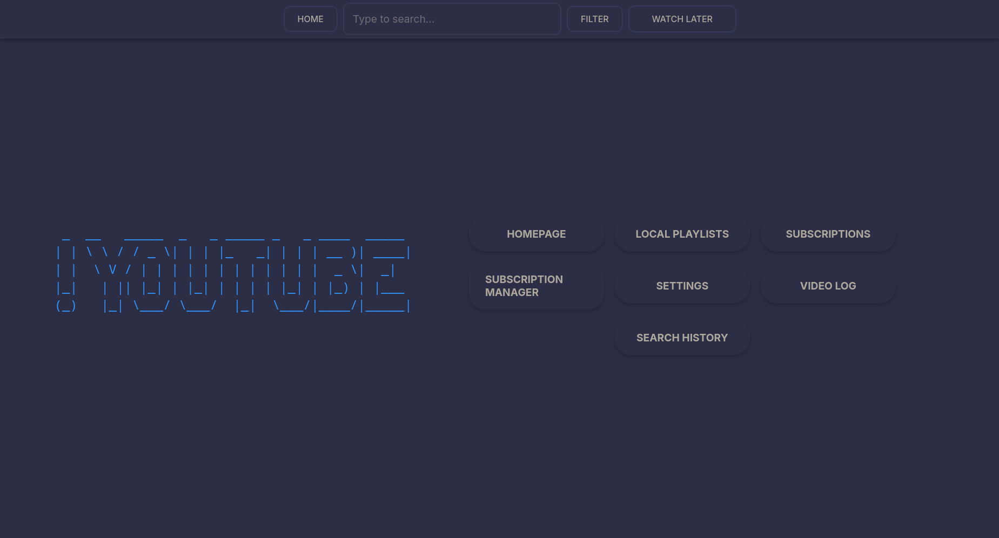
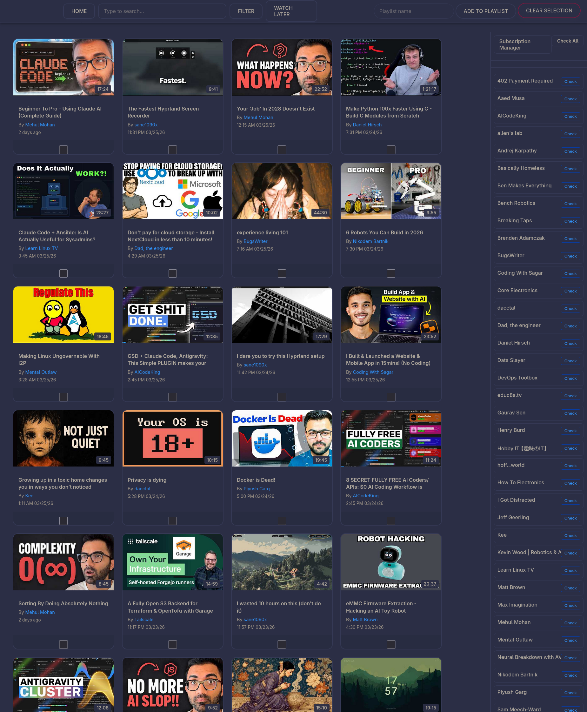
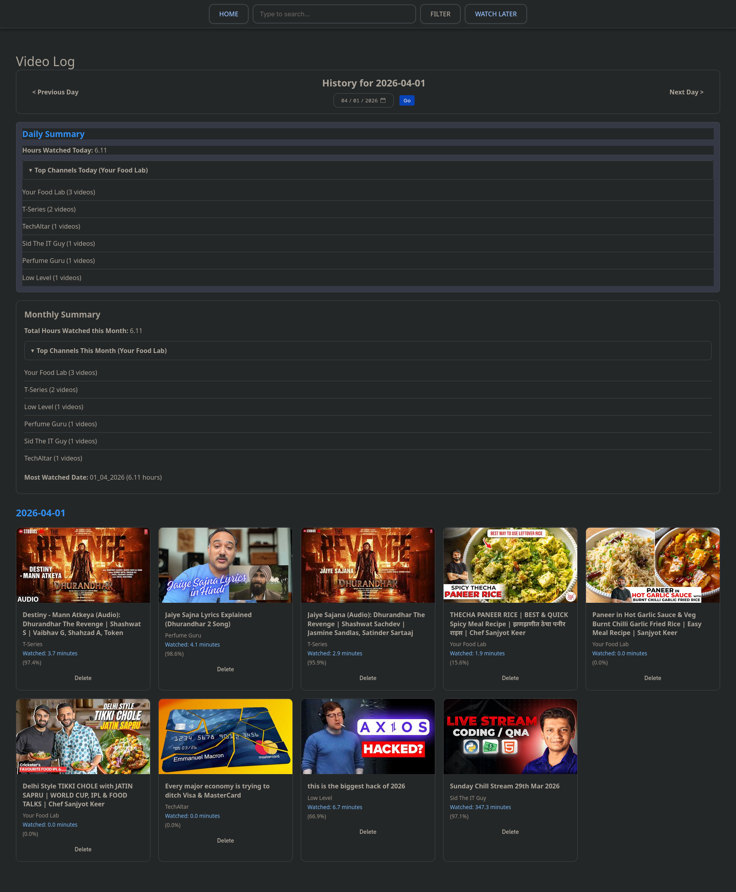
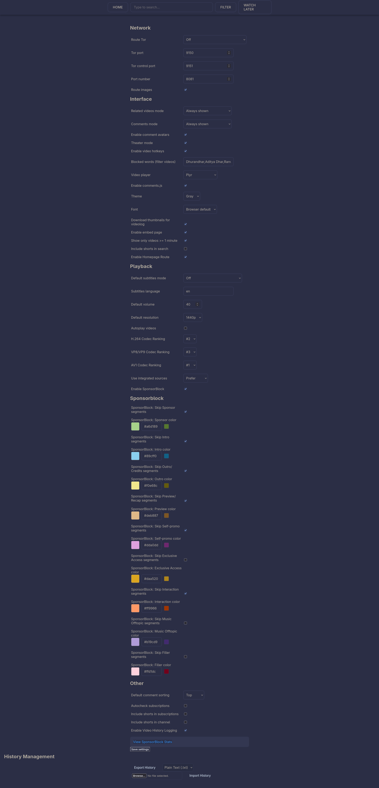
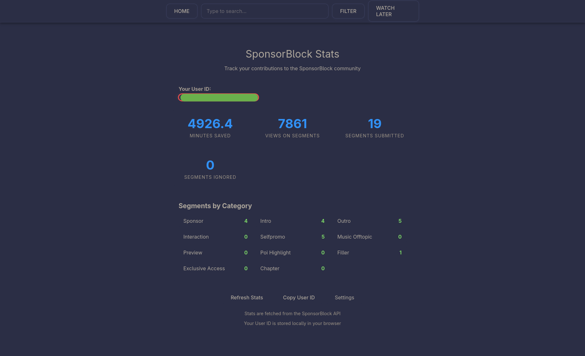

# YouTube Local

A privacy-focused YouTube client that runs entirely on your machine. Watch videos without tracking, download content, and enjoy YouTube without ads or Google's data collection.

## Why Use It?

YouTube Local gives you back control over your viewing experience:

- **Zero Tracking** - No Google account required. Your watch history stays on your machine,your subcriptions are local and so does your watch later.
- **No Ads** - Enjoy ad-free video playback with SponsorBlock integration to skip sponsor segments.
- **Lightweight & Fast** - Built with plain HTML/CSS: ~(16MB-19MB) idle, ~150MB for 1440p(25fps) video, ~170-190MB for 2160p(25).
- **Privacy** - All data stored locally. Optional Tor routing for enhanced anonymity.
- **MPV-like Controls** - Familiar keyboard shortcuts for power users.



## Features

### Core Features (from original)

- **Watch Videos Locally**: Stream YouTube videos directly on your machine without browser tracking
- **Video Log**: Browse and search through your watch history with detailed information including watch date, duration, and channel
- **Watch Later**: Save videos to watch later, with support for YouTube playlists (not just local playlists)
- **Subscriptions**: Subscribe to channels and browse new uploads from all subscribed channels
- **Custom Playlists**: Create and manage multiple local playlists with custom tags for organization
- **Search**: Search YouTube with filters, or search your watch history fuzzyly
- **Homepage**: View recently watched videos and their related video recommendations
- **Related Videos**: Browse related video recommendations (can be hidden or collapsed via settings)
- **Channel Browsing**: View videos, shorts, streams, and playlists from any channel
- **Tor Routing**: Optionally route all traffic through Tor for enhanced privacy
- **Comments**: View and browse video comments
- **Chapter Navigation**: Jump to video chapters easily
- **SponsorBlock**: Auto-skip sponsored segments with customizable categories
- **Download**: Download videos and audio in various formats
- **Keyboard Shortcuts**: Full control over video playback (MPV-like)
- **Heavily Customizable Settings**: Extensive settings for playback, interface, network, and SponsorBlock options

### Enhanced Features

- **Dynamic URL Handling**: Automatically detects and handles YouTube URLs from any format
- **Watch Later Playlists**: Support for YouTube playlists (not just local)
- **SponsorBlock Enhancements**:
  - Customizable skip categories (sponsor, intro, outro, preview, self-promo, etc.)
  - Color-coded segment markers on the progress bar
  - Submit new segments with `;` key shortcut
  - Time input in HH:MM:SS:MS format with "Now" buttons
  - View your submission stats
- **Content Filtering**: Block videos by keywords in settings (hides matching videos from search, related, homepage, and subscriptions)
- **Improved UI**: Enhanced grid/list view for channel pages with better thumbnails






## Installation

### Prerequisites

- Python 3.8+

### Quick Start

```bash
# Clone the repository
git clone https://github.com/niru124/youtube-local.git
cd youtube-local

# Run Install Script 
./install-systemd.sh

# Uninstall the program completely 🫪
./uninstall.sh
```

Open your browser and go to `http://localhost:8080` (or the port configured in settings).

## Usage

### Basic Controls(Customizable)

- `Space` - Play/Pause
- `J` - Rewind 10 seconds
- `L` - Forward 10 seconds
- `K` - Play/Pause
- `F` - Fullscreen
- `M` - Mute
- `[` / `]` - Playback Speed
- `0` / `9` - Volume Up/Down
- `;` - Start/stop SponsorBlock segment marking

### SponsorBlock

To submit segments:

1. Press `;` to start marking at current position
2. Press `;` again to stop marking
3. Adjust times if needed using the input fields or "Now" buttons
4. Select category and click Submit

To view your submission stats, go to Settings > SponsorBlock and click "View SponsorBlock Stats".

## Configuration

Settings can be modified through the web interface at `/settings` or by editing `settings.json`.

Key settings:

- `port_number` - Server port (default: 8080)
- `route_tor` - Route traffic through Tor
- `default_resolution` - Preferred video quality
- `related_videos_mode` - Show/hide related videos
- `blocked_keywords` - Block keywords(block keywords that u don't want to appear in search history/recommendations[, seperated])

## Acknowledgements

This project is Heavily inspired from [youtube-local](https://github.com/user234683/youtube-local) by [user234683](https://github.com/user234683).

Special thanks to the original author for creating such a fantastic privacy-focused YouTube client. This fork builds upon the excellent foundation to add enhanced features while maintaining the core philosophy of local, private video browsing.
